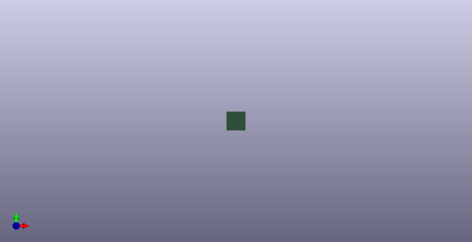

# Breakout Board Sensor Ibbc Oobb 3 2
 
## summary 
* classification: breakout_board
* type: sensor
* size: ibbc
* color: 
* description_main: oobb_3_2
* description_extra: 
* id: breakout_board_sensor_ibbc_oobb_3_2
* md5_6: 491dd2
* full details link: https://github.com/oomlout/oomlout_oomp_module_src/tree/main/modules/breakout_board_sensor_ibbc_oobb_3_2/working

## schematic  
  
[schematic (pdf)](kicad/current_version/working/working_schematic.pdf)  

## pcb  
 
  
  
  
[board (pdf)](kicad/current_version/working/working.pdf)  

