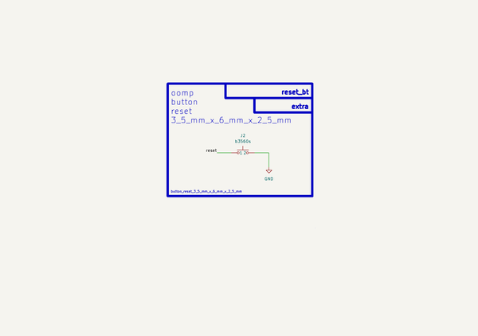

# Button Reset 3 5 Mm X 6 Mm X 2 5 Mm  
button_reset_3_5_mm_x_6_mm_x_2_5_mm  
 
## summary 
* classification: button
* type: reset
* size: 3_5_mm_x_6_mm_x_2_5_mm
* color: 
* description_main: 
* description_extra: 
* id: button_reset_3_5_mm_x_6_mm_x_2_5_mm
* md5_6: 928838
* full details link: https://github.com/oomlout/oomlout_oomp_module_src/tree/main/modules/button_reset_3_5_mm_x_6_mm_x_2_5_mm/working

## schematic  
  
[schematic (pdf)](kicad/current_version/working/working_schematic.pdf)  

## pcb  
 
  
  
  
[board (pdf)](kicad/current_version/working/working.pdf)  

