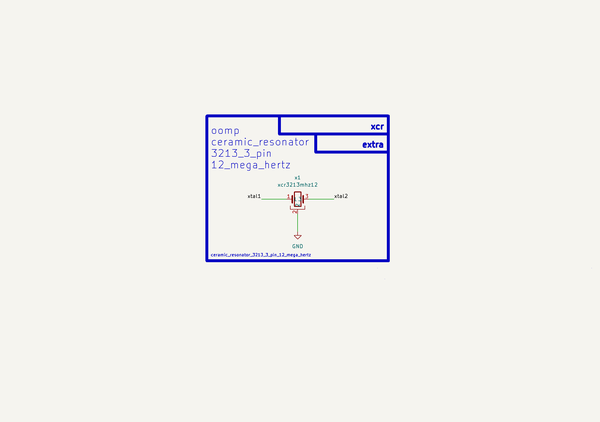

# Ceramic Resonator 3213 3 Pin 12 Mega Hertz  
ceramic_resonator_3213_3_pin_12_mega_hertz  
 
## summary 
* classification: ceramic_resonator
* type: 
* size: 3213_3_pin
* color: 
* description_main: 12_mega_hertz
* description_extra: 
* id: ceramic_resonator_3213_3_pin_12_mega_hertz
* md5_6: 0ab48c
* full details link: https://github.com/oomlout/oomlout_oomp_module_src/tree/main/modules/ceramic_resonator_3213_3_pin_12_mega_hertz/working

## schematic  
  
[schematic (pdf)](kicad/current_version/working/working_schematic.pdf)  

## pcb  
 
  
  
  
[board (pdf)](kicad/current_version/working/working.pdf)  

