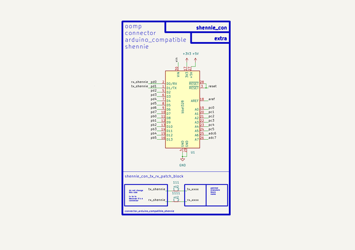
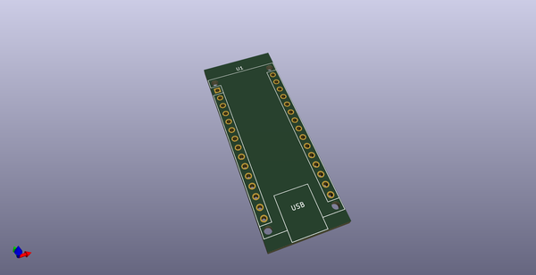
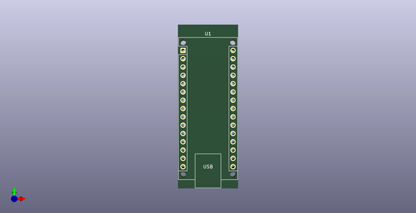
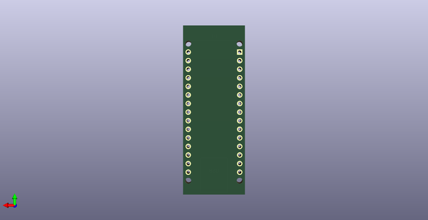
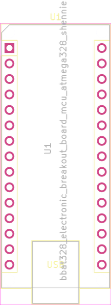

# Connector Arduino Compatible Shennie  
connector_arduino_compatible_shennie  
 
## summary 
* classification: connector
* type: arduino_compatible
* size: shennie
* color: 
* description_main: 
* description_extra: 
* id: connector_arduino_compatible_shennie
* md5_6: fd005d
* full details link: https://github.com/oomlout/oomlout_oomp_module_src/tree/main/modules/connector_arduino_compatible_shennie/working

## schematic  
  
[schematic (pdf)](kicad/current_version/working/working_schematic.pdf)  

## pcb  
 
  
  
  
[board (pdf)](kicad/current_version/working/working.pdf)  

