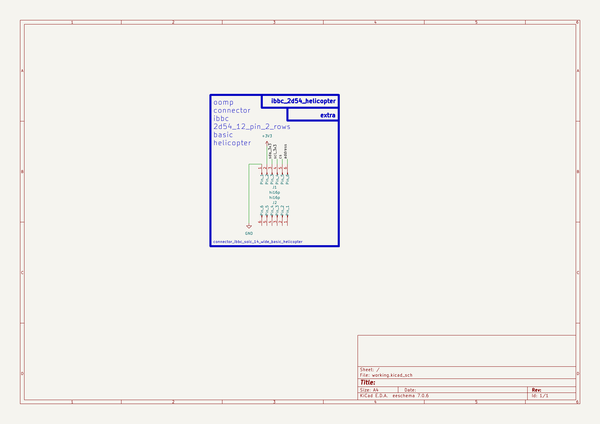

# Connector Ibbc 2D54 12 Pin Two Rows Basic Helicopter  
connector_ibbc_2d54_12_pin_two_rows_basic_helicopter  
 
## summary 
* classification: connector
* type: ibbc
* size: 2d54_12_pin_two_rows
* color: 
* description_main: basic
* description_extra: helicopter
* id: connector_ibbc_2d54_12_pin_two_rows_basic_helicopter
* md5_6: 133792
* full details link: https://github.com/oomlout/oomlout_oomp_module_src/tree/main/modules/connector_ibbc_2d54_12_pin_two_rows_basic_helicopter/working

## schematic  
  
[schematic (pdf)](kicad/current_version/working/working_schematic.pdf)  

## pcb  
 
  
  
  
[board (pdf)](kicad/current_version/working/working.pdf)  

