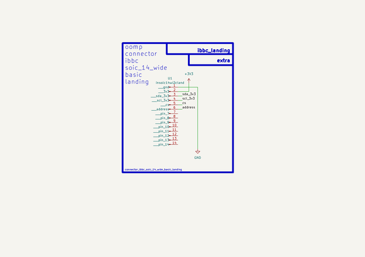

# Connector Ibbc Soic 14 Wide Basic Landing  
connector_ibbc_soic_14_wide_basic_landing  
 
## summary 
* classification: connector
* type: ibbc
* size: soic_14_wide
* color: 
* description_main: basic
* description_extra: landing
* id: connector_ibbc_soic_14_wide_basic_landing
* md5_6: 7dd537
* full details link: https://github.com/oomlout/oomlout_oomp_module_src/tree/main/modules/connector_ibbc_soic_14_wide_basic_landing/working

## schematic  
  
[schematic (pdf)](kicad/current_version/working/working_schematic.pdf)  

## pcb  
 
  
  
  
[board (pdf)](kicad/current_version/working/working.pdf)  

