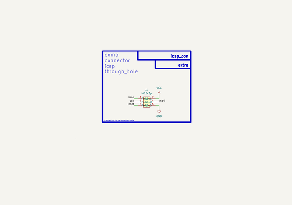

# Connector Icsp Through Hole  
connector_icsp_through_hole  
 
## summary 
* classification: connector
* type: 
* size: icsp
* color: 
* description_main: through_hole
* description_extra: 
* id: connector_icsp_through_hole
* md5_6: 8e167b
* full details link: https://github.com/oomlout/oomlout_oomp_module_src/tree/main/modules/connector_icsp_through_hole/working

## schematic  
  
[schematic (pdf)](kicad/current_version/working/working_schematic.pdf)  

## pcb  
 
  
  
  
[board (pdf)](kicad/current_version/working/working.pdf)  

