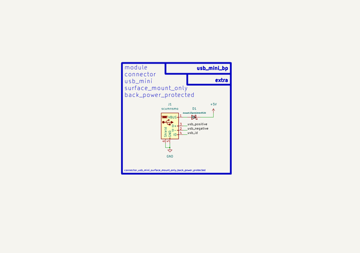

# Connector Usb Mini Surface Mount Only Back Power Protected  
connector_usb_mini_surface_mount_only_back_power_protected  
 
## summary 
* classification: connector
* type: 
* size: usb_mini
* color: 
* description_main: surface_mount_only
* description_extra: back_power_protected
* id: connector_usb_mini_surface_mount_only_back_power_protected
* md5_6: 3bae45
* full details link: https://github.com/oomlout/oomlout_oomp_module_src/tree/main/modules/connector_usb_mini_surface_mount_only_back_power_protected/working

## schematic  
  
[schematic (pdf)](kicad/current_version/working/working_schematic.pdf)  

## pcb  
 
  
  
  
[board (pdf)](kicad/current_version/working/working.pdf)  

