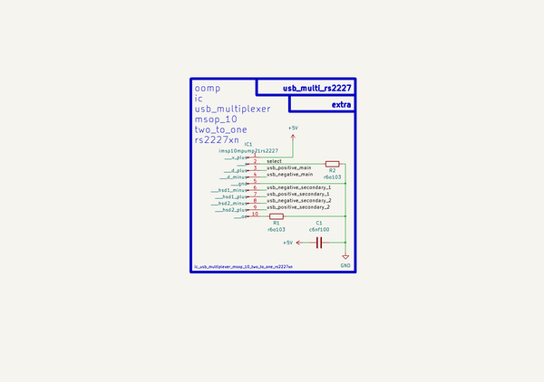

# Ic Usb Multiplexer Msop 10 Two To One Rs2227Xn  
ic_usb_multiplexer_msop_10_two_to_one_rs2227xn  
 
## summary 
* classification: ic
* type: usb_multiplexer
* size: msop_10
* color: 
* description_main: two_to_one
* description_extra: 
* id: ic_usb_multiplexer_msop_10_two_to_one_rs2227xn
* md5_6: 84a478
* full details link: https://github.com/oomlout/oomlout_oomp_module_src/tree/main/modules/ic_usb_multiplexer_msop_10_two_to_one_rs2227xn/working

## schematic  
  
[schematic (pdf)](kicad/current_version/working/working_schematic.pdf)  

## pcb  
 
  
  
  
[board (pdf)](kicad/current_version/working/working.pdf)  

