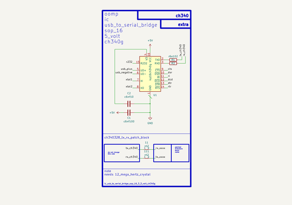

# Ic Usb To Serial Bridge Sop 16 5 Volt Ch340G  
ic_usb_to_serial_bridge_sop_16_5_volt_ch340g  
 
## summary 
* classification: ic
* type: usb_to_serial_bridge
* size: sop_16
* color: 
* description_main: 5_volt
* description_extra: 
* id: ic_usb_to_serial_bridge_sop_16_5_volt_ch340g
* md5_6: 86ef09
* full details link: https://github.com/oomlout/oomlout_oomp_module_src/tree/main/modules/ic_usb_to_serial_bridge_sop_16_5_volt_ch340g/working

## schematic  
  
[schematic (pdf)](kicad/current_version/working/working_schematic.pdf)  

## pcb  
 
  
  
  
[board (pdf)](kicad/current_version/working/working.pdf)  

