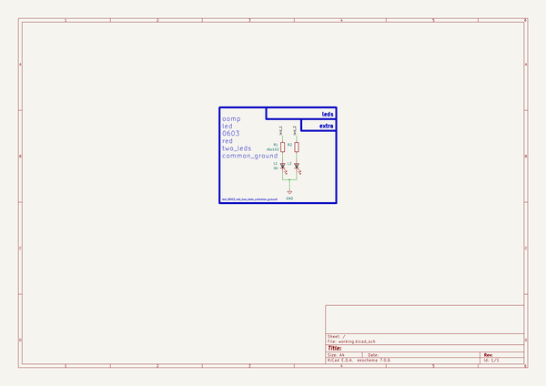

# Led 0603 Red Two Leds Common Ground  
led_0603_red_two_leds_common_ground  
 
## summary 
* classification: led
* type: 
* size: 0603
* color: red
* description_main: two_leds
* description_extra: common_ground
* id: led_0603_red_two_leds_common_ground
* md5_6: a618db
* full details link: https://github.com/oomlout/oomlout_oomp_module_src/tree/main/modules/led_0603_red_two_leds_common_ground/working

## schematic  
  
[schematic (pdf)](kicad/current_version/working/working_schematic.pdf)  

## pcb  
 
  
  
  
[board (pdf)](kicad/current_version/working/working.pdf)  

