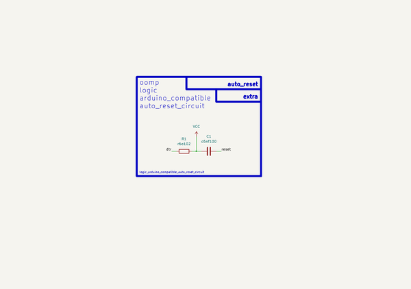

# Logic Arduino Compatible Auto Reset Circuit  
logic_arduino_compatible_auto_reset_circuit  
 
## summary 
* classification: logic
* type: arduino_compatible
* size: 
* color: 
* description_main: auto_reset_circuit
* description_extra: 
* id: logic_arduino_compatible_auto_reset_circuit
* md5_6: ad6ca4
* full details link: https://github.com/oomlout/oomlout_oomp_module_src/tree/main/modules/logic_arduino_compatible_auto_reset_circuit/working

## schematic  
  
[schematic (pdf)](kicad/current_version/working/working_schematic.pdf)  

## pcb  
 
  
  
  
[board (pdf)](kicad/current_version/working/working.pdf)  

