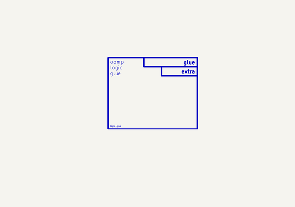

# Logic Glue  
logic_glue  
 
## summary 
* classification: logic
* type: glue
* size: 
* color: 
* description_main: 
* description_extra: 
* id: logic_glue
* md5_6: 3ba7c4
* full details link: https://github.com/oomlout/oomlout_oomp_module_src/tree/main/modules/logic_glue/working

## schematic  
  
[schematic (pdf)](kicad/current_version/working/working_schematic.pdf)  

## pcb  
 
  
  
  
[board (pdf)](kicad/current_version/working/working.pdf)  

