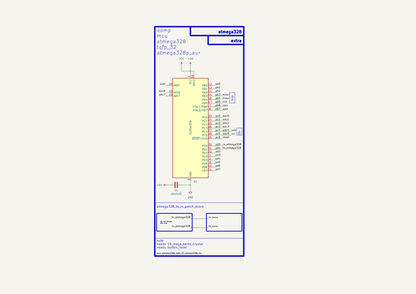

# Mcu Atmega328P Tqfp 32 Atmega328P Au  
mcu_atmega328p_tqfp_32_atmega328p_au  
 
## summary 
* classification: mcu
* type: atmega328p
* size: tqfp_32
* color: 
* description_main: 
* description_extra: 
* id: mcu_atmega328p_tqfp_32_atmega328p_au
* md5_6: fcd45d
* full details link: https://github.com/oomlout/oomlout_oomp_module_src/tree/main/modules/mcu_atmega328p_tqfp_32_atmega328p_au/working

## schematic  
  
[schematic (pdf)](kicad/current_version/working/working_schematic.pdf)  

## pcb  
 
  
  
  
[board (pdf)](kicad/current_version/working/working.pdf)  

