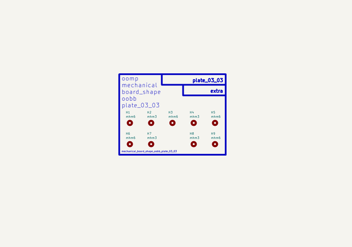
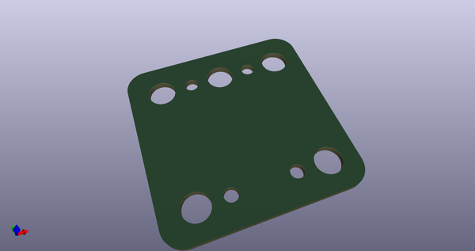
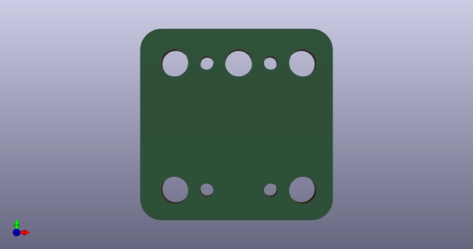
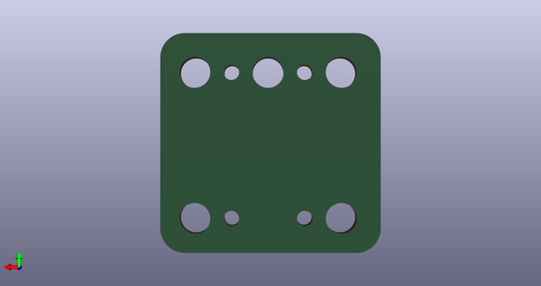

# Mechanical Board Shape Oobb Plate 03 03  
mechanical_board_shape_oobb_plate_03_03  
 
## summary 
* classification: mechanical
* type: board_shape
* size: oobb
* color: 
* description_main: plate_03_03
* description_extra: 
* id: mechanical_board_shape_oobb_plate_03_03
* md5_6: 6e5e8f
* full details link: https://github.com/oomlout/oomlout_oomp_module_src/tree/main/modules/mechanical_board_shape_oobb_plate_03_03/working

## schematic  
  
[schematic (pdf)](kicad/current_version/working/working_schematic.pdf)  

## pcb  
 
  
  
  
[board (pdf)](kicad/current_version/working/working.pdf)  

