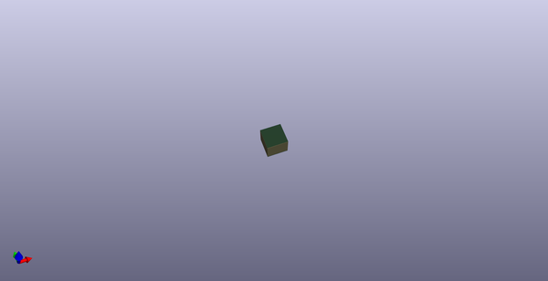

# Power Linear Sot 223 1117 5 Volt Output  
power_linear_sot_223_1117_5_volt_output  
 
## summary 
* classification: power
* type: linear
* size: sot_223
* color: 1117
* description_main: 5_volt_output
* description_extra: 
* id: power_linear_sot_223_1117_5_volt_output
* md5_6: 3b0efb
* full details link: https://github.com/oomlout/oomlout_oomp_module_src/tree/main/modules/power_linear_sot_223_1117_5_volt_output/working

## schematic  
  
[schematic (pdf)](kicad/current_version/working/working_schematic.pdf)  

## pcb  
 
  
  
  
[board (pdf)](kicad/current_version/working/working.pdf)  

