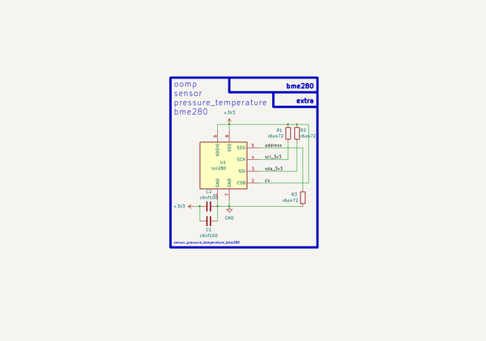

# Sensor Pressure Temperature Bme280  
sensor_pressure_temperature_bme280  
 
## summary 
* classification: sensor
* type: 
* size: 
* color: 
* description_main: pressure_temperature
* description_extra: 
* id: sensor_pressure_temperature_bme280
* md5_6: c586e6
* full details link: https://github.com/oomlout/oomlout_oomp_module_src/tree/main/modules/sensor_pressure_temperature_bme280/working

## schematic  
  
[schematic (pdf)](kicad/current_version/working/working_schematic.pdf)  

## pcb  
 
  
  
  
[board (pdf)](kicad/current_version/working/working.pdf)  

