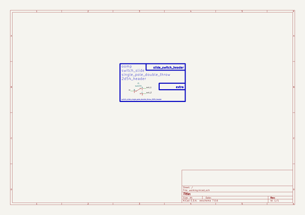

# Switch Slide Single Pole Double Throw 2D54 Header  
switch_slide_single_pole_double_throw_2d54_header  
 
## summary 
* classification: switch_slide
* type: single_pole_double_throw
* size: 2d54_header
* color: 
* description_main: 
* description_extra: 
* id: switch_slide_single_pole_double_throw_2d54_header
* md5_6: 921437
* full details link: https://github.com/oomlout/oomlout_oomp_module_src/tree/main/modules/switch_slide_single_pole_double_throw_2d54_header/working

## schematic  
  
[schematic (pdf)](kicad/current_version/working/working_schematic.pdf)  

## pcb  
 
  
  
  
[board (pdf)](kicad/current_version/working/working.pdf)  

