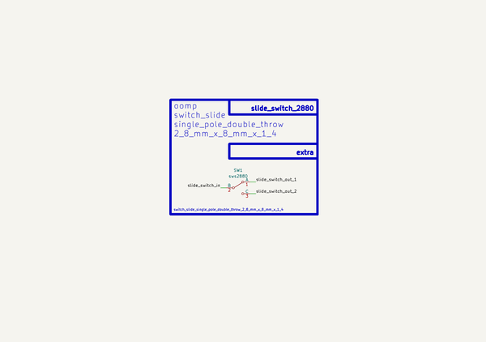

# Switch Slide Single Pole Double Throw 2 8 Mm X 8 Mm X 1 4  
switch_slide_single_pole_double_throw_2_8_mm_x_8_mm_x_1_4  
 
## summary 
* classification: switch_slide
* type: single_pole_double_throw
* size: 2_8_mm_x_8_mm_x_1_4
* color: 
* description_main: 
* description_extra: 
* id: switch_slide_single_pole_double_throw_2_8_mm_x_8_mm_x_1_4
* md5_6: 73f180
* full details link: https://github.com/oomlout/oomlout_oomp_module_src/tree/main/modules/switch_slide_single_pole_double_throw_2_8_mm_x_8_mm_x_1_4/working

## schematic  
  
[schematic (pdf)](kicad/current_version/working/working_schematic.pdf)  

## pcb  
 
  
  
  
[board (pdf)](kicad/current_version/working/working.pdf)  

